# During Design Testing Notes
The test is mainly focused on the backend functionality, as the front-end user interface is still under development.

## 1. Authentication
### Test:Register
**Expected result**
The user account was successfully created and redirected to the login page.

**Actual result**
The account with username "12345" was successfully created, and after completing the registration, it automatically redirected to the login page successfully.

**Result**
Pass

**Evidence**
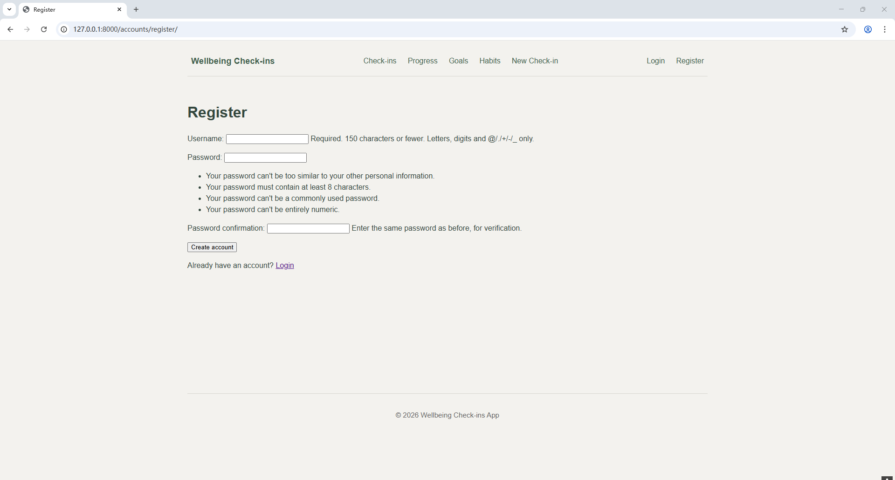
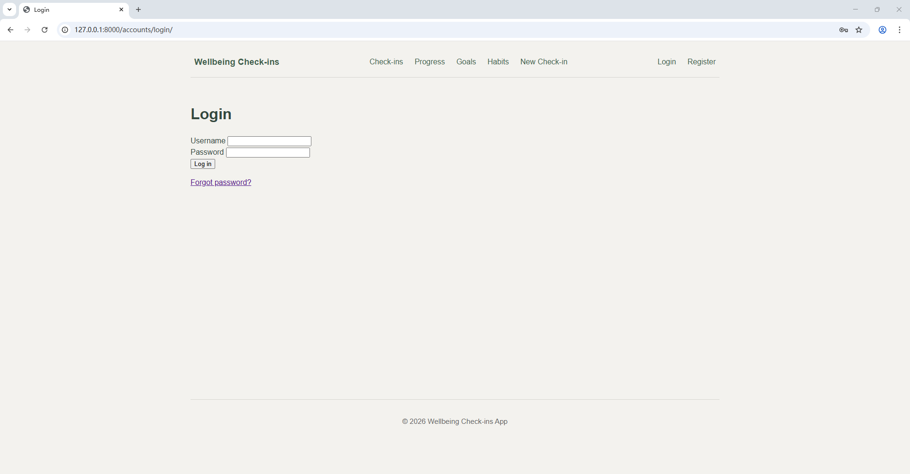

### Test:Login
**Expected result**
Users who have registered previously can log in and access the check-in page.

**Actual result**
Successfully logged in and can access the check-in page

**Result**
Pass

**Evidence**
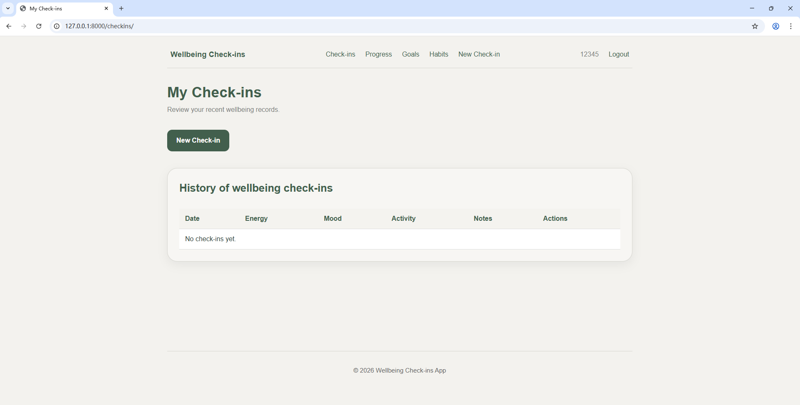

### Test:Logout
**Excepted result**
The user has successfully logged out and if user wish to access the check-in (i.e., the protected page), the user need to log in again.

**Actual result**
Successfully logged out and returned to the login page. Click "check-in" to enter, as login is required for access.

**Result**
Pass

**Evidence**

## 2. Route protection
### Test:Access protected page without login
**Excepted result**
The system should redirect the user to the login page.

**Actual result**
The system redirected to `/accounts/login/`.

**Result**
Pass

**Evidence**

## 3. Check-in CRUD operations
### Test:create check-in
**Excepted result**
A new check-in record should be created and added to the list.

**Actual result**
The check-in record was successfully created and displayed in the list.

**Result**
Pass

**Evidence**
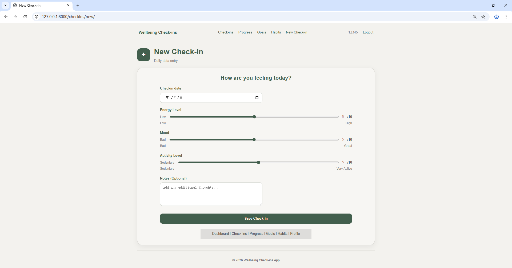
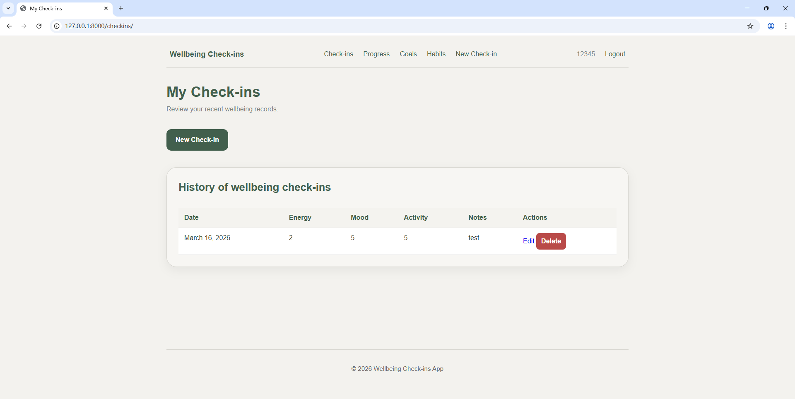

### Test:Edit check-in
**Excepted result**
The updated check-in value should have been successfully saved. After logging in again, it will be able to see.

**Actual result**
The check-in was successfully updated. On the "process" page, can see the created check-in.

**Result**
Pass

**Evidence**
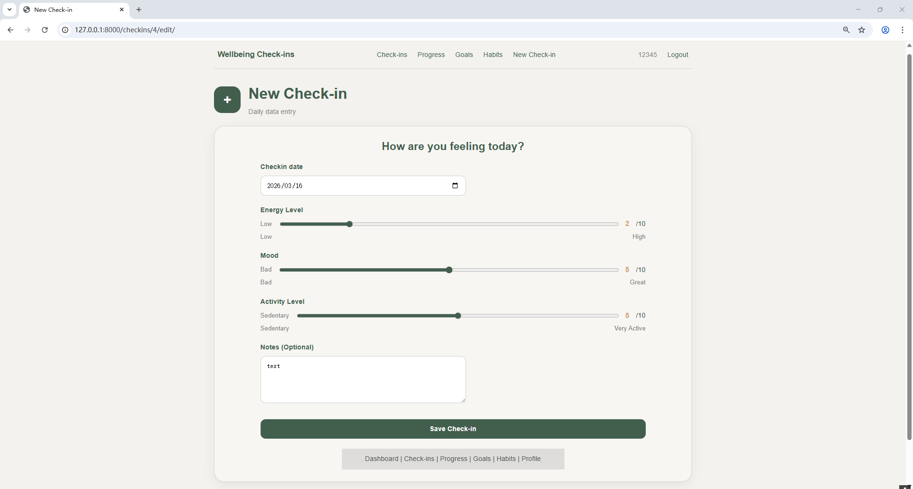
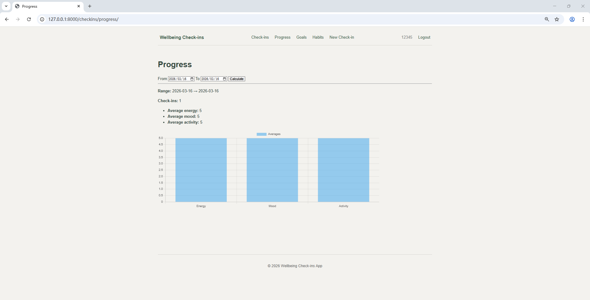

### Test:Delete check-in
**Excepted result**
The check-in value should be removed from the list.

**Actual result**
The check-in value was successfully deleted.

**Result**
Pass
**Evidence**
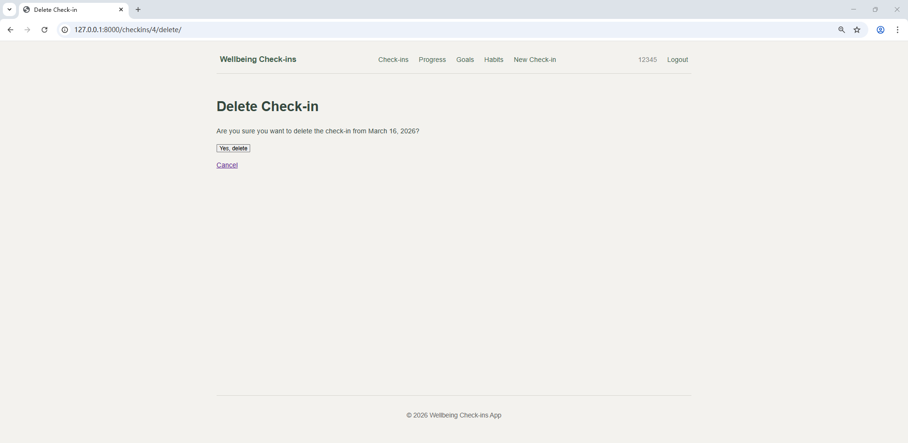

## 4. Ownership protection
### Test:User cannot edit another user's data
**Excepted result**
User 12345 logged in and created a sign-in record. User 12345 logged out, then User 123 logged in. User 123 attempted to access the sign-in editing page of User 12345. User 123 should not be able to edit the data of User 12345.

**Actual result**
The access of user 123 has been denied, and the record of user 12345 cannot be modified.

**Result**
Pass

**Evidence**
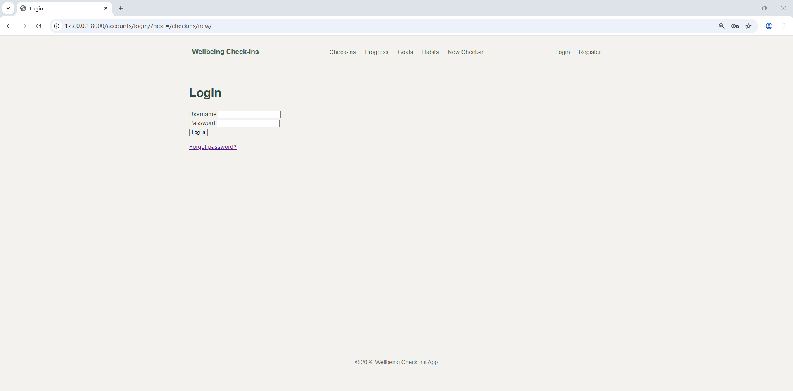

## 5. API endpoint testing
### Test:API check-ins endpoint
**Excepted result**
The endpoint should return JSON data containing the user's check-in records.

**Actual result**
The endpoint returned valid JSON containing the check-in records.

**Result**
Pass

**Evidence**
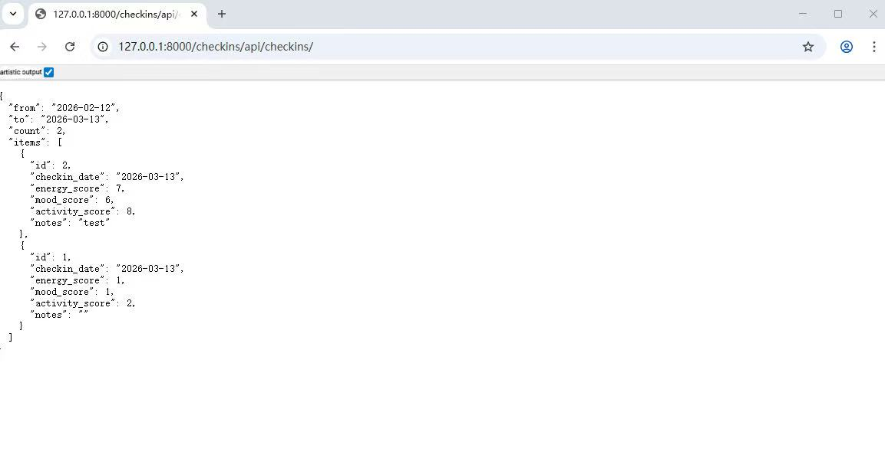

### Test:API progress endpoint
**Excepted result**
The endpoint should return aggregated progress data includ count and averages.

**Actual result**
The endpoint returned JSON data with count and averages field.

**Result**
Pass

**Evidence**
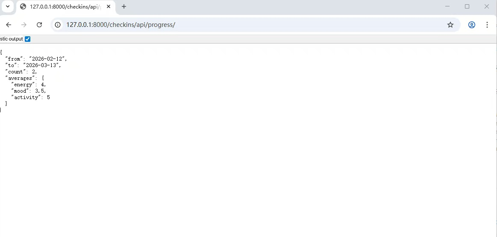

### Test:API Requires Authentication
**Excepted result**
The API should not allow access without authentication and should redirect to the login page.

**Actual result**
The system redirected to the login page when accessing the API endpoint without login in.

**Result**
Pass

**Evidence**

## 6. Validation Testing
### Test:Registration validation
**Excepted result**
The system should prevent submission and show validation error.

**Actual result**
The form display validation errors and the account was not created.

**Result**
Pass

**Evidence**
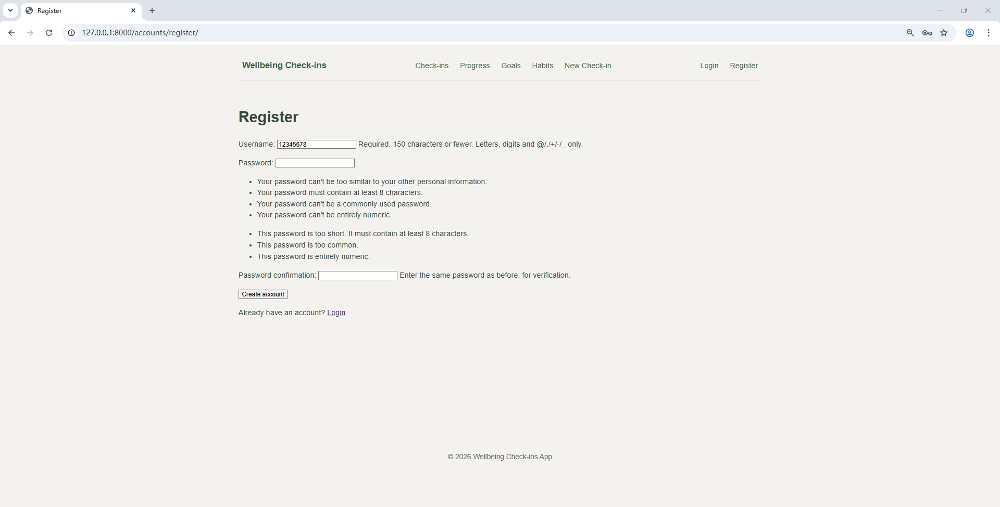

### Test:Check-in form validation
**Excepted result**
The system should display validation errors

**Actual result**
The system prevented the invalid submission operation and displayed an error message.

**Result**
Pass

**Evidence**
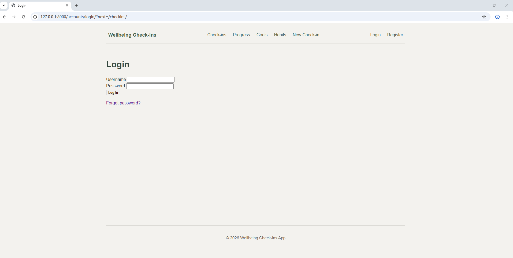

## 7. Goal CRUD operations
### Test:Create goal
**Expected result**
A new goal should be created and show in the goal list.

**Actual result**
The goal was successfully created and displayed in the goal list.

**Result**
Pass

**Evidence**
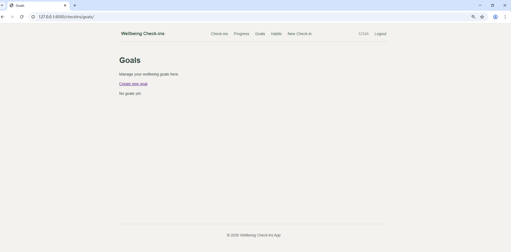
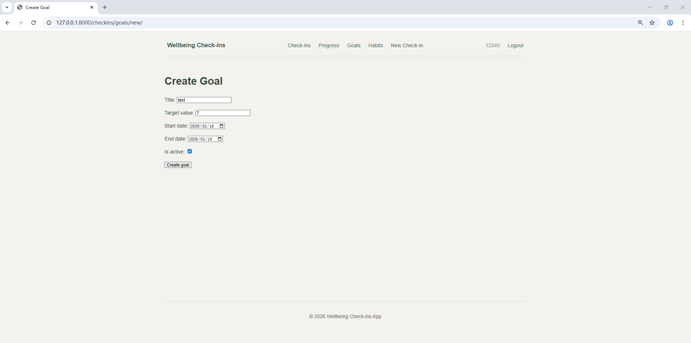

### Test:Edit goal
**Expected result**
The updated goal values should be saved successfully.

**Actual result**
The goal was successfully updated.

**Result**
Pass

**Evidence**
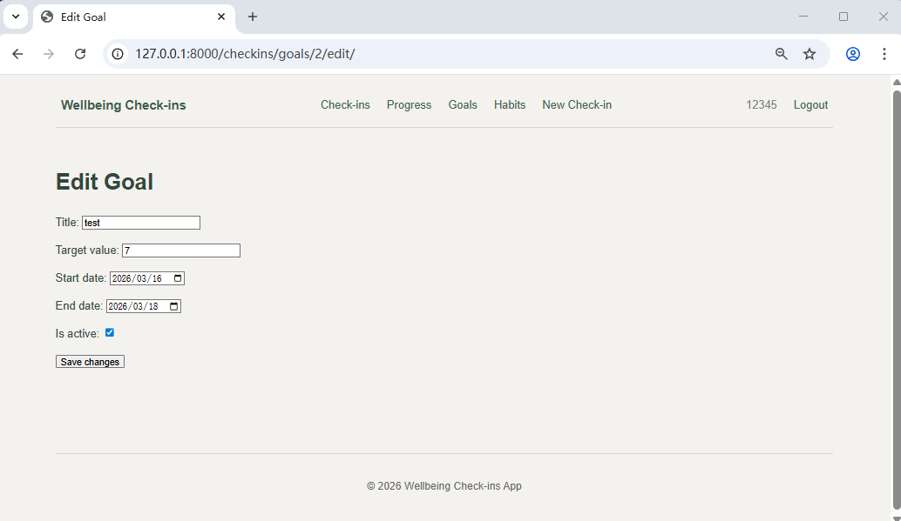

### Test:Delete goal
**Expected result**
The goal should be removed from the list.

**Actual result**
The goal was successfully deleted.

**Result**
Pass

**Evidence**
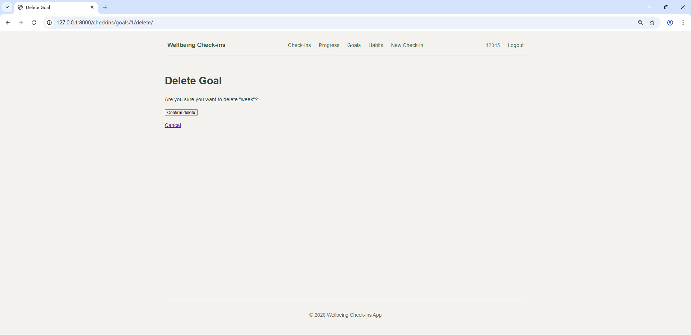

### Test:Goal validation
**Expected result**
The system should reject goals with an end date earlier than the start date.

**Actual result**
The system displayed a validation error and the goal was not created.

**Result**
Pass

**Evidence**
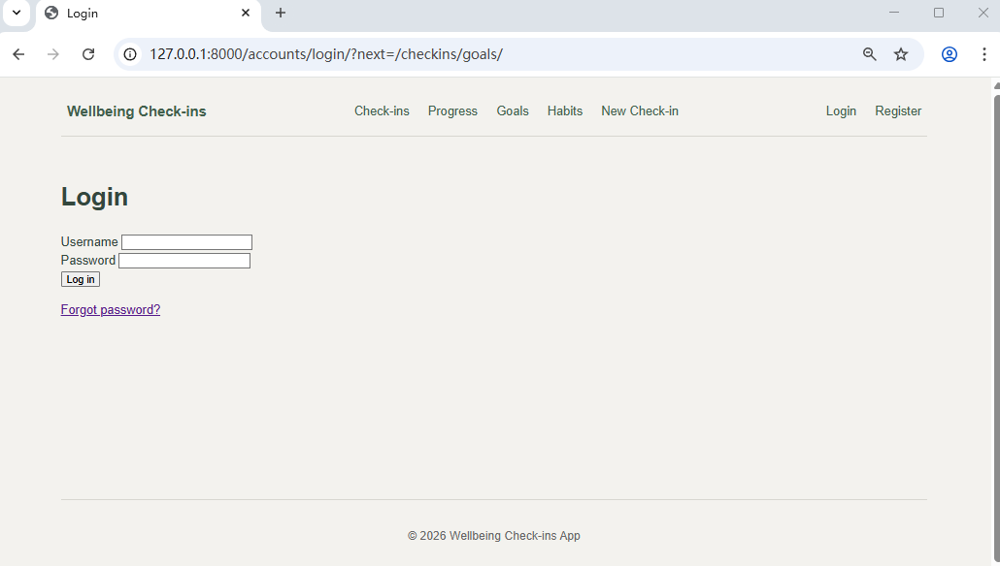

## 8.Habit CRUD operations
### Test:Create habit
**Expected result**
A new habit should be created and displayed in the list.

**Actual result**
The habit was successfully created and displayed.

**Result**
Pass

**Evidence**
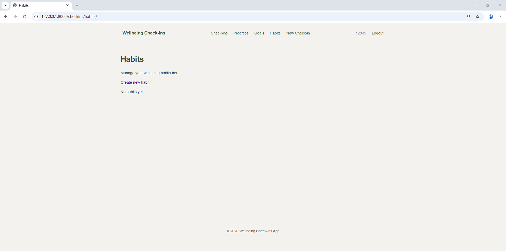

### Test:Edit habit
**Expected Result**
A new habit should be created and displayed in the list.

**Actual Result**
The habit was successfully created and displayed.

**Result**
Pass

**Evidence**
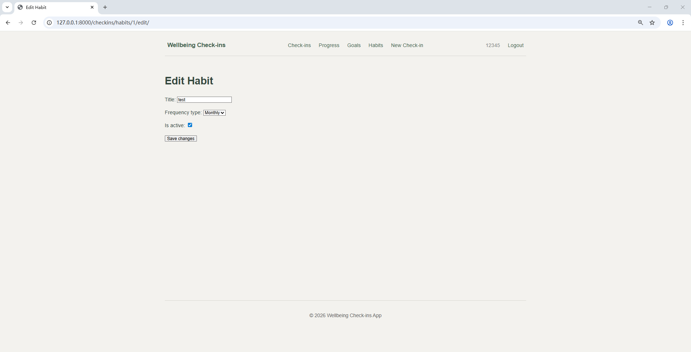

### Test:Delete habit
**Expected Result**
The habit should be removed from the list.

**Actual Result**
The habit was successfully deleted.

**Result**
Pass

**Evidence**
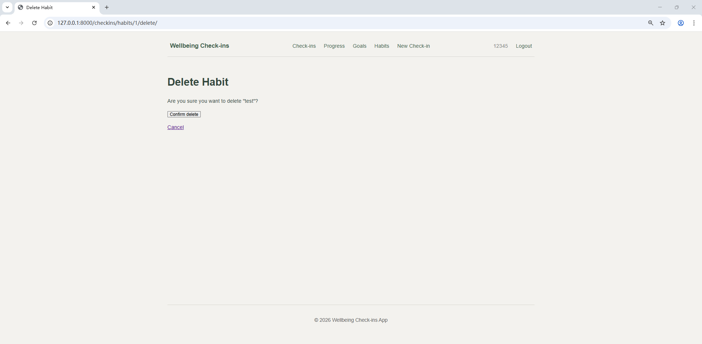

## 9.Unit test execution
**Command**
python manage.py test checkins -v 2

**Expected Result**
All unit tests should run successfully without failures.

**Actual Result**
All unit tests executed successfully and passed.

**Result**
Pass

**Evidence**
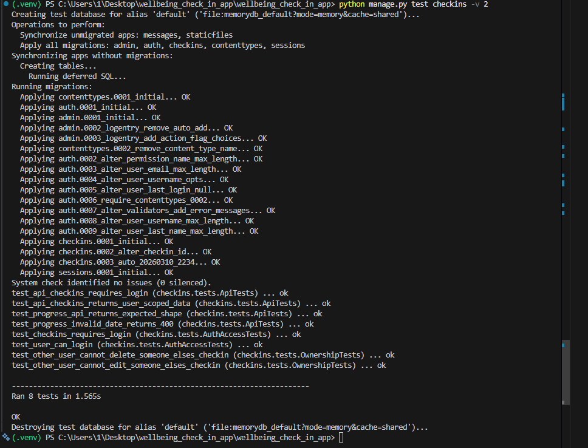